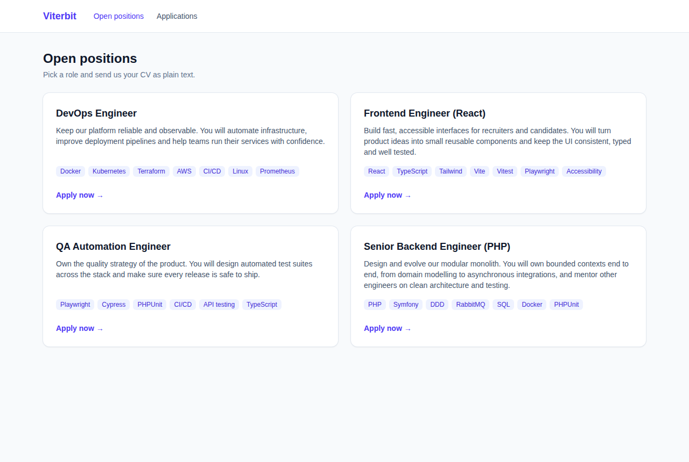
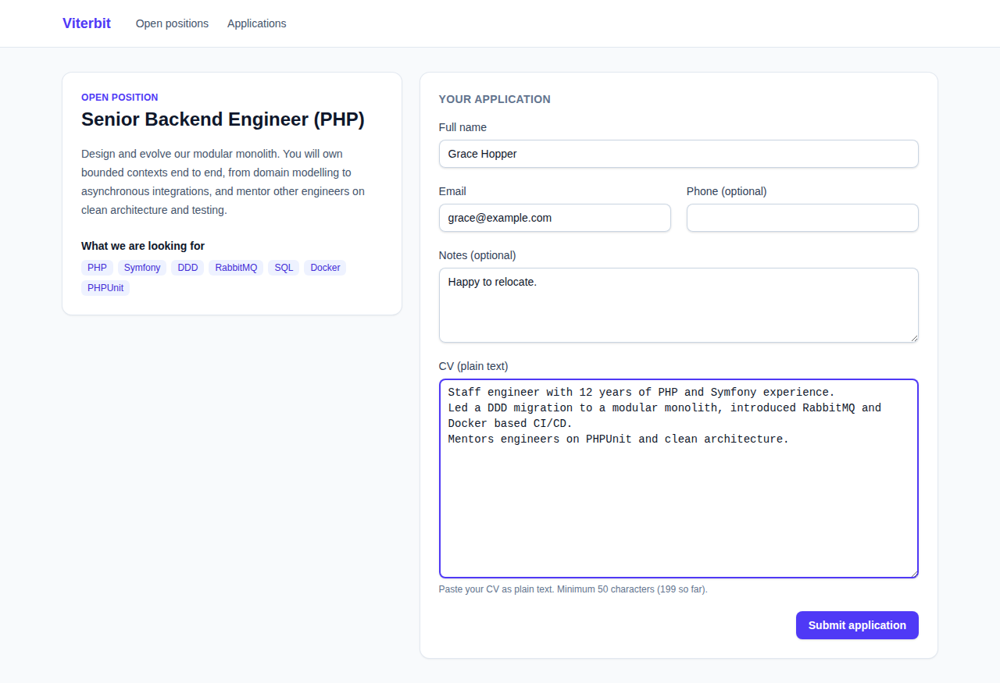
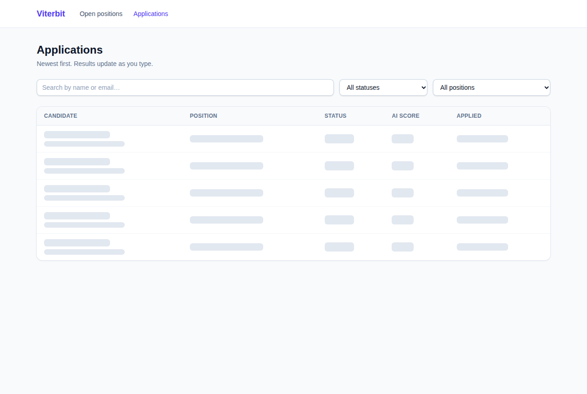
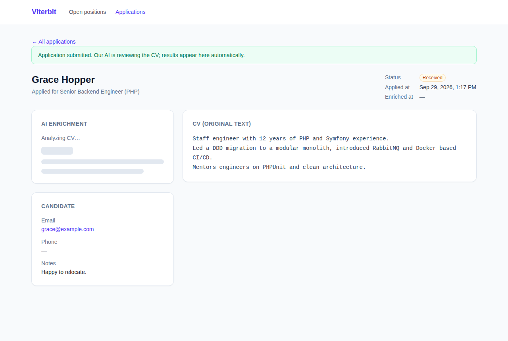
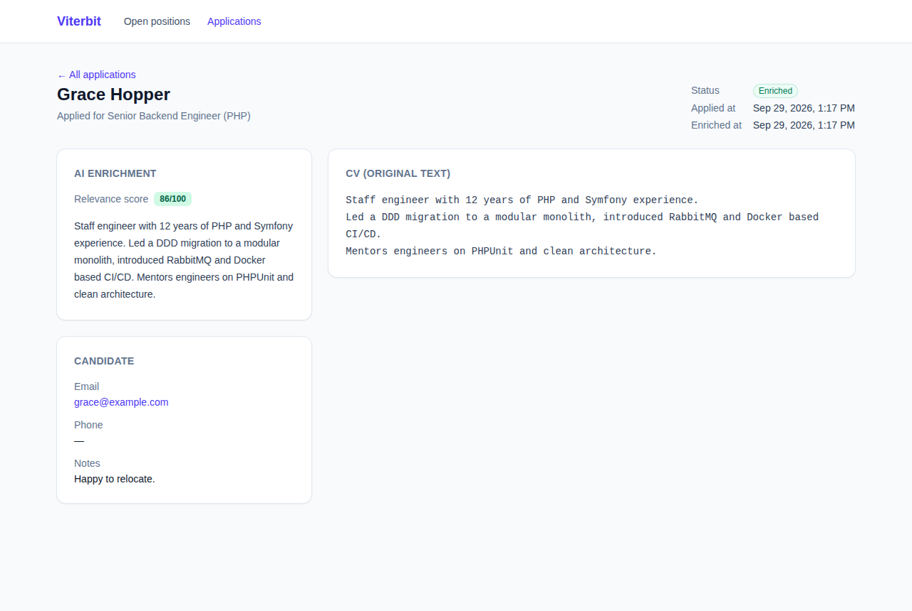
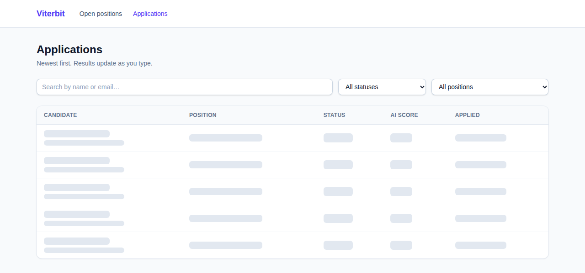
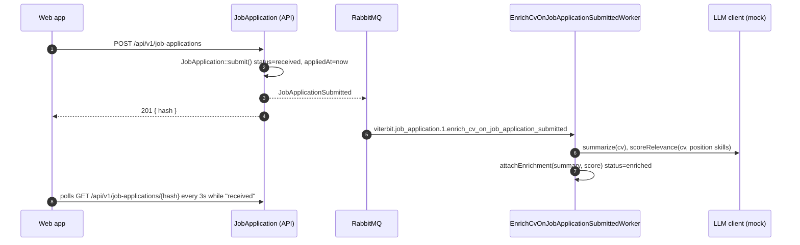

# Viterbit PoC — Applicant Tracking System

A small applicant tracking system where candidates apply to open positions by pasting their CV as plain text. Recruiters browse and filter applications in real time. Each CV is enriched **asynchronously** by a (mocked) LLM, which writes a short summary and a relevance score for the position.

| Open positions | Apply | Applications |
|---|---|---|
|  |  |  |

| Detail while enriching | Detail after enrichment | Loading skeletons |
|---|---|---|
|  |  |  |

---

## Contents

1. [Requirements](#requirements)
2. [Quick start](#quick-start)
3. [Commands](#commands)
4. [Architecture](#architecture)
5. [Messaging](#messaging)
6. [Data model](#data-model)
7. [API](#api)
8. [AI enrichment (mocked LLM)](#ai-enrichment-mocked-llm)
9. [Frontend](#frontend)
10. [Testing](#testing)
11. [Code quality](#code-quality)
12. [Conventions](#conventions)
13. [Decisions and trade-offs](#decisions-and-trade-offs)
14. [Troubleshooting](#troubleshooting)

---

## Requirements

- Docker with Docker Compose v2
- GNU Make

Nothing else is needed on the host. PHP, Node, pnpm, PostgreSQL, RabbitMQ and the browsers used by the tests all run in containers. The project uses **pnpm** only, never npm, and the `frontend` and `playwright` images ship it.

These ports must be free:

| Port | Service |
|---|---|
| `5173` | Web app (Vite) |
| `8000` | API (FrankenPHP) |
| `5672` | RabbitMQ (AMQP) |
| `15672` | RabbitMQ management UI |
| `5432` | PostgreSQL |

## Quick start

```bash
make init
```

This command creates `backend/.env` from `backend/.env.example` (if it does not exist yet), builds the images, installs dependencies, starts the stack, runs the migrations and seeds the position catalog. After that:

| What | URL |
|---|---|
| App | http://localhost:5173 |
| API health | http://localhost:8000/api/health |
| RabbitMQ UI | http://localhost:15672 — user `viterbit_admin`, password `viterbit_admin_password` (dev only) |

`backend/.env` is ignored by git, so each clone gets its own copy. To create it without running the rest of `init`, run `make env` or `cp backend/.env.example backend/.env`. When you add a variable, add it to `backend/.env.example` too.

Try it: open a position, apply, and watch the detail page switch from *Analyzing CV…* to the AI summary and score after about 2 seconds.

## Commands

Run `make` or `make help` to list every command.

| Command | What it does |
|---|---|
| `make help` | Lists all commands |
| `make init` | Runs `build` + `install` + `up` + migrations. One command, ready to use |
| `make build` | Builds the Docker images |
| `make install` | Runs `composer install` (backend) and `pnpm install` (frontend) in their containers, and enables the git hooks |
| `make up` | Starts the stack in the background and waits until it is healthy |
| `make down` | Stops and removes the containers |
| `make restart` | Runs `down` + `up` |
| `make ps` | Shows container status |
| `make sh` | Opens a shell in the `php` container. Use `make sh c=frontend` for another service |
| `make logs` | Follows logs. Use `make logs c=worker-enrich-cv-on-job-application-submitted` for one service |
| `make db-migrate` | Runs migrations (dev and test databases) |
| `make db-reset` | Drops the PostgreSQL databases (dev and test) and migrates again |
| `make test` | Runs every test suite except mutation |
| `make test <suite>` | Runs one suite: `unit`, `integration`, `functional`, `smoke`, `e2e`, `mutation`, `front`, `front-e2e` |
| `make stan` | Runs PHPStan (level 9) |
| `make deptrac` | Checks architecture layers and bounded context boundaries |
| `make lint` | Runs php-cs-fixer (dry run), ESLint and TypeScript type checking |
| `make fix` | Auto-fixes code style (php-cs-fixer, ESLint) |
| `make check` | Runs everything CI would run: `lint` + `stan` + `deptrac` + `test` + `mutation` |

Examples:

```bash
make test unit
make test front-e2e
make sh c=frontend
```

## Architecture

**Modular monolith** built with **DDD**, **hexagonal architecture** and **CQRS with domain events**.

```
backend/src/
├── Shared/          Shared kernel: buses, Criteria, AggregateRoot, value objects, LLM connection
├── JobPosition/     Catalog of open job positions (read-only)
└── JobApplication/  Submit, search and view applications, and enrich CVs asynchronously. Owns the application lifecycle
```

Each bounded context has three layers:

| Layer | Contains | May depend on |
|---|---|---|
| `Domain` | Aggregates, value objects, domain events, repository ports | Domain, plus Doctrine ORM mapping attributes |
| `Application` | Commands and queries with their handlers, workers, DTOs, ports | Domain, PSR interfaces |
| `Infrastructure` | Controllers, request DTOs and view models, Doctrine repositories, custom DBAL types, adapters | Everything above, plus the framework |

Inside each layer, files are grouped by type:

```
JobApplication/
├── Domain/          Entity/ ValueObject/ Enum/ Event/ Repository/ Exception/
├── Application/     Command/ Query/ Handler/ Dto/ Worker/ Service/ Port/ Exception/
└── Infrastructure/  Http/{Controller,Dto,ViewModel}/ Persistence/ JobPosition/
```

Bounded contexts never import each other's internals. They talk through their **published contract**: domain events and application queries/DTOs. The one exception is `JobApplication`, which holds a Doctrine `ManyToOne` relation to `JobPosition` and may therefore use its entity, value objects and repository. Deptrac enforces both rules (see [Code quality](#code-quality)).

### Request flow (CQRS)

- **Writes** go through the **command bus**: controller → request DTO → command → handler → aggregate → repository → domain events.
- **Reads** go through the **query bus**: controller → query → handler → repository (with the **Criteria** pattern for filters, ordering and pagination) → DTO → view model.
- Controllers contain no logic. They build the command or query, dispatch it, and map the result to a view model.

### Event flow



The enrichment is part of `JobApplication`: it has no state of its own, and job applications are its only consumer. The HTTP request never waits for the LLM, because a worker runs the enrichment. `JobApplication` depends only on the `ILlmClient` port in `Shared`, never on a provider. Extract it into its own context once another context needs to enrich something.

## Messaging

### Naming standard

| Element | Pattern | Example |
|---|---|---|
| Event | `{company}.{service}.{version}.event.{entity}.{action}` | `viterbit.job_application.1.event.job_application.submitted` |
| Queue | `{company}.{service}.{version}.{action}_on_{event}` | `viterbit.job_application.1.enrich_cv_on_job_application_submitted` |
| Dead letter queue | `{queue}.dead_letter` | `viterbit.job_application.1.enrich_cv_on_job_application_submitted.dead_letter` |
| Retry queue (temporary) | `{queue}.delay_{ms}_retry` | created and expired by RabbitMQ |

The event name travels as the AMQP `type` property of every message.

### One name for every piece

The queue, the Messenger transport (which both publishes and consumes), the worker class and the Docker service share the same name:

| Queue | Transport | Worker | Docker service |
|---|---|---|---|
| `viterbit.job_application.1.enrich_cv_on_job_application_submitted` | `enrich_cv_on_job_application_submitted` | `EnrichCvOnJobApplicationSubmittedWorker` | `worker-enrich-cv-on-job-application-submitted` |

### Topology, vhost and users

The whole topology is declared once, in `docker/rabbitmq/definitions.json`, and RabbitMQ loads it at boot. The application does not create exchanges or queues.

- **vhost** `viterbit`
- **users**: `viterbit_app` (the application; permissions only on `viterbit`) and `viterbit_admin` (management UI). The default `guest` user does not exist.
- **exchanges**: `viterbit.domain_events` (events), `viterbit.domain_events.delays` (retries), `viterbit.domain_events.dead_letter` (failures)
- **queues and bindings**: one queue per worker and one dead letter queue per queue

### Retries and failures

Each worker retries a failing message **3 times** with exponential backoff (1s, 2s, 4s). After that, the message moves to that queue's dead letter queue, where you can inspect it in the RabbitMQ UI. To add a new reaction to an event, add a queue, a transport and a worker with the same name. Each consumer gets its own copy of the event.

## Data model

**PostgreSQL 18**, accessed through **Doctrine ORM 3** with attribute mapping on the entities. Value objects are stored with custom DBAL types (`job_application_hash`, `email`, `ai_score`, `utc_datetime_immutable`…), and `JobApplication` references `JobPosition` through a `ManyToOne` relation on `job_position_id`. The schema lives in plain SQL migrations, and `make lint` validates the mapping with `doctrine:schema:validate --skip-sync`. Tables are singular and columns use `snake_case`. Every table has an autoincrement integer `id` (primary key, used by every foreign key and relation, including across bounded contexts) and a unique `hash` holding a UUID v7. The `hash` is the entity's identity in the domain and the only identifier the API exposes; the integer `id` never leaves the persistence layer.

```sql
CREATE TABLE job_position (
    id INTEGER GENERATED BY DEFAULT AS IDENTITY PRIMARY KEY,
    hash UUID NOT NULL UNIQUE,              -- UUID v7
    title TEXT NOT NULL,
    description TEXT NOT NULL,
    required_skills JSONB NOT NULL,
    created_at TIMESTAMP(6) NOT NULL
);

CREATE TABLE job_application (
    id INTEGER GENERATED BY DEFAULT AS IDENTITY PRIMARY KEY,
    hash UUID NOT NULL UNIQUE,              -- UUID v7
    job_position_id INTEGER NOT NULL REFERENCES job_position (id),
    candidate_full_name TEXT NOT NULL,
    candidate_email TEXT NOT NULL,
    candidate_phone TEXT NULL,
    notes TEXT NULL,
    cv_text TEXT NOT NULL,
    status TEXT NOT NULL CHECK (status IN ('received', 'enriched')),
    ai_summary TEXT NULL,
    ai_score SMALLINT NULL CHECK (ai_score BETWEEN 0 AND 100),
    applied_at TIMESTAMP(6) NOT NULL,       -- UTC, microseconds
    enriched_at TIMESTAMP(6) NULL
);

CREATE INDEX idx_job_application_applied_at ON job_application (applied_at DESC);
CREATE INDEX idx_job_application_status_applied_at ON job_application (status, applied_at DESC);
CREATE INDEX idx_job_application_job_position_id_applied_at ON job_application (job_position_id, applied_at DESC);
CREATE INDEX idx_job_application_candidate_email ON job_application (candidate_email);
```

The indexes match the list screen: newest first, optionally filtered by status or position. The tests use their own database, `viterbit_test` (Doctrine's `dbname_suffix` in the `test` environment), which `make db-migrate` and the test bootstrap create if it is missing. Search is case-insensitive through `LOWER(…) LIKE LOWER(…)`, because PostgreSQL's `LIKE` is case-sensitive. The migration history table is also singular: `migration_version`.

To inspect the data: `docker compose exec postgres psql -U viterbit -d viterbit` (dev credentials `viterbit` / `viterbit_password`, also reachable on `localhost:5432`).

## API

All payloads are JSON with `snake_case` keys.

| Method | Path | Description |
|---|---|---|
| `GET` | `/api/health` | Liveness check |
| `GET` | `/api/v1/job-positions` | Lists open positions |
| `GET` | `/api/v1/job-positions/{hash}` | Returns one position |
| `POST` | `/api/v1/job-applications` | Submits an application |
| `GET` | `/api/v1/job-applications` | Lists applications, newest first |
| `GET` | `/api/v1/job-applications/{hash}` | Returns one application in full |

**Submit**

```http
POST /api/v1/job-applications
{
  "job_position_hash": "0199a0e0-0000-7000-8000-000000000001",
  "candidate_full_name": "Ada Lovelace",
  "candidate_email": "ada@example.com",
  "candidate_phone": "+34 600 000 000",
  "notes": "Available immediately.",
  "cv_text": "Senior PHP developer with eight years of experience..."
}

201 Created
{ "hash": "01a0ea0c-d07d-7d23-992c-7c820c0bcfed" }
```

**Search** — `GET /api/v1/job-applications?status=enriched&job_position_hash=…&search=ada&page=1&per_page=20`

| Parameter | Description |
|---|---|
| `status` | `received` or `enriched` |
| `job_position_hash` | Job position hash (UUID) |
| `search` | Case-insensitive match on candidate name or email |
| `page`, `per_page` | Pagination (default `1` and `20`; `per_page` is at most 100) |

```json
{
  "items": [
    {
      "hash": "…",
      "job_position_hash": "…",
      "candidate_full_name": "Ada Lovelace",
      "candidate_email": "ada@example.com",
      "status": "enriched",
      "ai_score": 71,
      "applied_at": "2026-09-28T22:05:03+00:00"
    }
  ],
  "total": 1,
  "page": 1,
  "per_page": 20
}
```

**Detail** — returns the summary fields plus `candidate_phone`, `notes`, `cv_text`, `ai_summary` and `enriched_at`.

**Errors**

| Status | When | Body |
|---|---|---|
| `422` | Invalid payload or query | `{ "error": "Validation failed.", "errors": { "candidate_email": "…" } }` |
| `422` | Unknown position | `{ "error": "Job position \"…\" does not exist." }` |
| `404` | Unknown resource | `{ "error": "Job application \"…\" not found." }` |

## AI enrichment (mocked LLM)

As the exercise requires, no real LLM is called. The mock is **deterministic**, so tests and demos are repeatable:

- **Summary**: the leading whole sentences of the CV that fit in 280 characters.
- **Score**: the percentage of the position's required skills that the CV mentions (whole words, case-insensitive).
- **Latency**: each call sleeps `MOCK_LLM_LATENCY_MS` (default 1000 ms, set in `config/services.yaml`) so you can see the asynchrony in the UI. The tests set it to 0.

The LLM connection lives in `Shared`, so any context can use it:

- `ILlmClient` is the port, with `summarize()` and `scoreRelevance()`.
- `LlmClientBuilder` builds the client for the provider selected with `LLM_PROVIDER` (default `mock`). Neither variable needs to be in `.env`: set it only to override the default.
- `JobApplication` only calls its own service, `CvEnricher`, which scores the CV against the required skills of the application's job position.

To plug in a real provider, add a client that implements `ILlmClient`, add a case to `LlmProviderEnum`, and teach the builder to build it. Business code does not change.

## Frontend

React 19 + TypeScript 7 + Tailwind, built with Vite.

- **Typed contract**: interfaces in `src/types` mirror the API payloads one to one (`snake_case`).
- **Small, reusable components**: generic UI in `src/components/ui`, screen-specific pieces in `src/features/*`, and composition in `src/pages`.
- **Real-time filtering**: search and filters update the URL, so filtered views can be shared. Requests are **debounced (300 ms)**, and a new request aborts the previous one.
- **No blank screens**: skeletons mirror the real layout during the first load. Later refreshes keep the current data on screen.
- **Live enrichment**: the list and the detail poll every 3 s while an application is still `received`, and stop once it is enriched.

## Testing

| Suite | Command | What it covers |
|---|---|---|
| Unit | `make test unit` | Aggregates, value objects, handlers, workers, mock LLM, LLM builder |
| Integration | `make test integration` | Doctrine repositories, mapping and Criteria on a real PostgreSQL database (filters, case-insensitive search, ordering, pagination, LIKE escaping). Event routing to the right transport |
| Functional | `make test functional` | HTTP API: submission (201/422), filters and search, detail (200/404), `snake_case` contract |
| Smoke | `make test smoke` | Every read endpoint answers 200 with JSON |
| E2E (backend) | `make test e2e` | Submit, then run the worker, then the application is enriched with a summary and a score |
| Mutation | `make test mutation` | Infection on the unit suite. Fails below 80% MSI or 90% covered MSI (currently about 96%). `pcov` is off in `php.ini` and only turned on for this run |
| Front unit | `make test front` | Vitest: query string building and parsing, HTTP client |
| Front component | `make test front` | Vitest browser mode (Playwright/Chromium): form submission and API errors, filters, fast typing sends one request, skeleton then rows, badges |
| Front E2E | `make test front-e2e` | Playwright against the running stack: apply, asynchronous enrichment, search, filters, newest first, detail |

The acceptance criteria map to tests as follows: **submission** (functional + e2e), **filtering and search** (integration + functional + front), and **enrichment** (unit + backend e2e + front e2e).

## Code quality

- **PHPStan level 9** over `src`, `tests` and `migrations`.
- **Deptrac**, with two rule sets:
  - `deptrac.layers.yaml`: Domain → only `Doctrine\ORM\Mapping` attributes, Application → Domain, Infrastructure → everything.
  - `deptrac.contexts.yaml`: a context may only use `Shared` and the published contract (events, queries and DTOs) of other contexts. `JobApplication` may also use `JobPositionAggregate` (the `JobPosition` entity, value objects and repository), because of the ORM relation.
- **php-cs-fixer** with `@PER-CS2x0` + `@Symfony` and `declare(strict_types=1)` everywhere.
- **ESLint** with `typescript-eslint` strict type-checked rules, React Hooks rules, and naming rules that enforce the conventions below.
- **TypeScript 7** (`tsc --noEmit`, strict, `exactOptionalPropertyTypes`, `noUncheckedIndexedAccess`).

`make check` runs all of it.

**Git hooks** in `.githooks/`, enabled by `make install`/`make init` with `git config core.hooksPath .githooks` (no extra tooling on the host):

| Hook | Runs | Covers |
|---|---|---|
| `pre-commit` | `make lint stan deptrac` | php-cs-fixer, Doctrine mapping, ESLint, tsc, PHPStan and deptrac |
| `pre-push` | `make test` | Every backend and frontend test suite, end-to-end included |

The checks run inside the Docker stack, so the hooks stop with a clear message if it is not up (`make up`). Use `git commit --no-verify` or `git push --no-verify` to skip them in an emergency.

## Conventions

| Element | Convention | Example |
|---|---|---|
| Interfaces (PHP and TS) | `I` prefix | `IJobApplicationRepository`, `IJobPositionDto` |
| Enums | `Enum` suffix | `JobApplicationStatusEnum` |
| DTOs | `Dto` suffix | `SubmitJobApplicationRequestDto`, `JobApplicationDetailDto` |
| HTTP responses | `ViewModel` suffix | `JobApplicationDetailViewModel` |
| Async consumers | `Worker` suffix, named after their queue | `EnrichCvOnJobApplicationSubmittedWorker` |
| JSON over HTTP | `snake_case` | `candidate_full_name` |
| PHP and TS identifiers | `camelCase` | `candidateFullName` |
| Tables and columns | singular, English, `snake_case` | `job_application.applied_at` |

## Decisions and trade-offs

- **PostgreSQL + Doctrine ORM with attributes**: a production-grade database with native `UUID`, `JSONB` and `TIMESTAMP(6)` columns, and it still takes no setup because it runs in Docker. The mapping lives next to the entities. The domain accepts the `Doctrine\ORM\Mapping` attributes as its only framework dependency. XML mapping would keep the domain fully framework-free at the cost of a separate file per entity.
- **Polling instead of push**: one small hook and no extra infrastructure. FrankenPHP ships a Mercure hub if you need push later.
- **Save and publish share a transaction, but there is no transactional outbox**: the command bus runs each command inside a Doctrine transaction (`doctrine_transaction` middleware). If RabbitMQ rejects the event, the save is rolled back and the API answers 500 with nothing stored. The case left is a commit that fails after the event was published. The worker then cannot find the application, retries and ends in the dead letter queue. Add an outbox table if that case becomes a concern.
- **Search uses `LOWER(…) LIKE '%…%'`**: fine at this scale. Move to PostgreSQL full-text search or a `pg_trgm` index if data grows.
- **TypeScript 7 and ESLint**: typescript-eslint does not support TS 7 yet. TypeScript 7 (the native compiler) type-checks the project, and a TS 6 package is installed only as ESLint's parser.
- **Out of scope**: authentication, manual status changes (for example shortlisted or rejected), and an `enrichment_failed` status. Failures are visible in the dead letter queues.

## Troubleshooting

| Problem | Fix |
|---|---|
| A port is already in use | Stop whatever uses it, or change the published port in `docker-compose.yml` |
| Applications stay in *received* | Check the workers with `make ps` and `make logs c=worker-enrich-cv-on-job-application-submitted` |
| Broken or dirty database | `make db-reset` |
| A message failed | Open RabbitMQ UI → vhost `viterbit` → queue `….dead_letter` |
| Dependencies are out of sync after a pull | `make install` |
